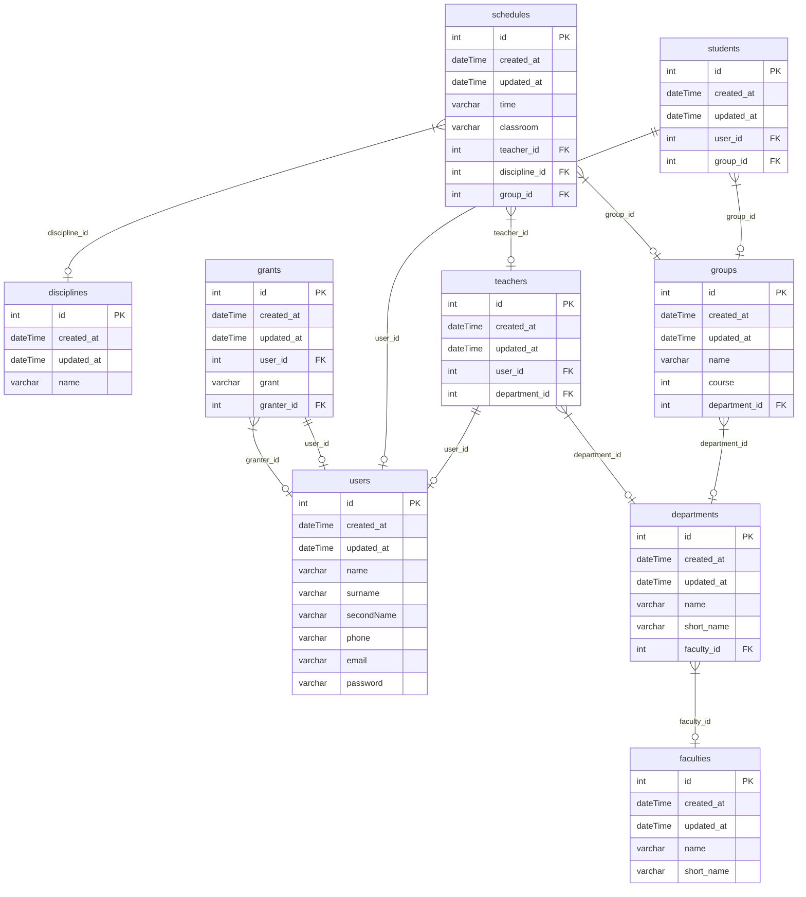

# Web register

## University managing web application

### This application allows you to manage the university schedule and all realted entities with it (like students, teachers, etc.)

```mermaid
erDiagram

  disciplines {
      int id PK
      dateTime created_at
      dateTime updated_at
      varchar name
  }

  faculties {
      int id PK
      dateTime created_at
      dateTime updated_at
      varchar name
      varchar short_name
  }

  users {
    int id PK
      dateTime created_at
      dateTime updated_at
      varchar name
      varchar surname
      varchar secondName
      varchar phone
      varchar email
      varchar password
  }

  departments }|--o| faculties: faculty_id
  departments {
    int id PK
      dateTime created_at
      dateTime updated_at
      varchar name
      varchar short_name
    int faculty_id FK
  }

  groups }|--o| departments: department_id
  groups {
        int id PK
      dateTime created_at
      dateTime updated_at
      varchar name
      int course
      int department_id FK
  }

  teachers ||--o| users: user_id
  teachers }|--o| departments: department_id
  teachers {
      int id PK
      dateTime created_at
      dateTime updated_at
      int user_id FK
      int department_id FK
  }

  students ||--o| users: user_id
  students }|--o| groups: group_id
  students {
        int id PK
      dateTime created_at
      dateTime updated_at
      int user_id FK
      int group_id FK
  }

  schedules }|--o| teachers: teacher_id
  schedules }|--o| disciplines: discipline_id
  schedules }|--o| groups: group_id
  schedules {
      int id PK
      dateTime created_at
      dateTime updated_at
      varchar time
      varchar classroom
      int teacher_id FK
      int discipline_id FK
      int group_id FK
  }

  grants ||--o| users: user_id
  grants }|--o| users: granter_id
  grants {
    int id PK
    dateTime created_at
    dateTime updated_at
    int user_id FK
    varchar grant
    int granter_id FK
  }

```
