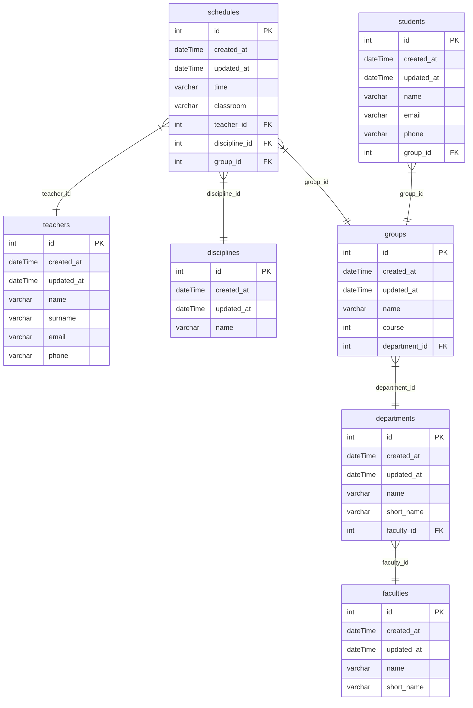

# Web register

## University managing web application

```mermaid
erDiagram

  disciplines {
      int id PK
      dateTime created_at
      dateTime updated_at
      varchar name
  }

  faculties {
      int id PK
      dateTime created_at
      dateTime updated_at
      varchar name
      varchar short_name
  }

  teachers {
      int id PK
      dateTime created_at
      dateTime updated_at
      varchar name
      varchar surname
      varchar email
      varchar phone
  }

  departments }|--|| faculties: faculty_id
  departments {
    int id PK
      dateTime created_at
      dateTime updated_at
      varchar name
      varchar short_name
    int faculty_id FK
  }

  groups }|--|| departments: department_id
  groups {
        int id PK
      dateTime created_at
      dateTime updated_at
      varchar name
      int course
      int department_id FK
  }

  students }|--|| groups: group_id
  students {
        int id PK
      dateTime created_at
      dateTime updated_at
      varchar name
      varchar email
      varchar phone
      int group_id FK
  }

  schedules }|--|| teachers: teacher_id
  schedules }|--|| disciplines: discipline_id
  schedules }|--|| groups: group_id
  schedules {
        int id PK
      dateTime created_at
      dateTime updated_at
      varchar time
      varchar classroom
      int teacher_id FK
      int discipline_id FK
      int group_id FK
  }

```
